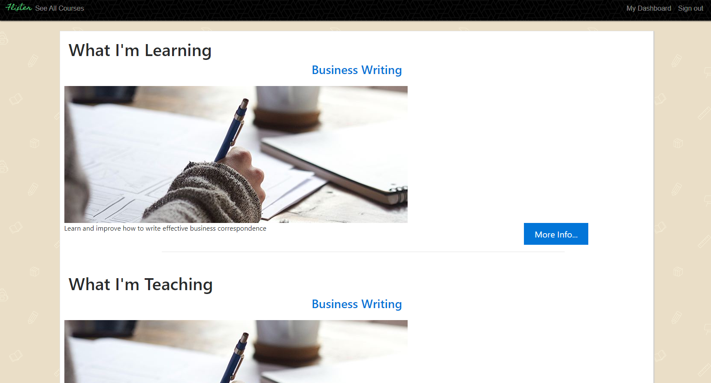

# README

Flixter is written with Ruby on Rails, JavaScript and jQuery.
Flixter is an easy-to-use platform for teachers to create courses.  Students can take free courses or make payments to ones requiring purchase inside the app.  
Payments are processed by Stripe.  Devise is used for sign-in forms and security.

See it in action <a href="https://flixter-winnie-khuu.herokuapp.com">here</a>

## TECHNOLOGIES USED
* HTML
* CSS
* JavaScript
* Ruby
* Rails
* Algorithms
* Vagrant
* PuTTY
* RubyMine

## SEE IT LOCALLY

1. Download the repository and unzip the files.
2. In your preferred coding environment, navigate to the folder `cd XXXXX/flixter-master`
3. Run `bundle install` to install the required Ruby gems.
3. Run `rake db:create db: migrate` to set up the database.
4. Visit your localhost link (i.e. localhost:3030 or localhost:3000)

## SCREENSHOTS

Index page

See All Courses page (can be seen before login)

Course details page (can be seen before login.  Cannot be accessed further until login and course purchase.)

Login/Sign up page

User dashboard

Course details page student preview for instructor (i.e. course creator)

Course details page for instructor to do modifications and also button to preview as student

Add new section to course modal

Add new lesson to section modal

Course payment via Stripe payment modal

Stripe payment dashboard
